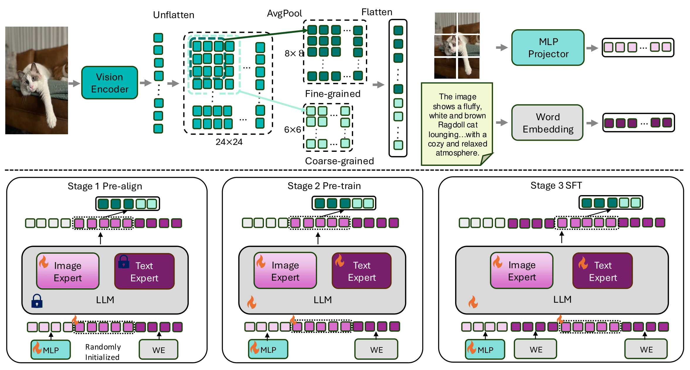

## BREEN: Bridge Data-Efficient Encoder-Free Multimodal Learning with Learnable Queries

Official pytorch implementation of [**BREEN: Bridge Data-Efficient Encoder-Free Multimodal Learning with Learnable Queries**](https://arxiv.org/abs/2503.12446).  

Our model can be downloaded at HF 🤗[BREEN](https://huggingface.co/tianleliphoebe/BREEN).

## Motivation

- **Can we build an encoder-free VLM that matches encoder-based performance with less data?**

- **How can we distill rich visual semantics into an LLM without a vision encoder?**

## Architecture
<p align="center">
  
</p>


- **Authors**: [Tianle Li](https://scholar.google.com/citations?user=g213g7YAAAAJ&hl=en), [Yongming Rao📧](https://scholar.google.com/citations?user=3qO6gK4AAAAJ&hl=en), [Winston Hu](https://scholar.google.com/citations?user=Jkss014AAAAJ&hl=en), [Yu Cheng📧](https://scholar.google.com/citations?user=ORPxbV4AAAAJ&hl=en)

- **Institutes**: The Chinese University of Hong Kong; Tencent Hunyuan Research

## Install

#### Environment

```bash
git clone https://github.com/ltl3A87/BREEN.git
cd BREEN
conda create -n breen python=3.10 -y
conda activate breen

pip install --upgrade pip
pip install -e .
pip install -e ".[train]"
pip install flash-attn --no-build-isolation
```

#### Preparation

Download `Qwen/Qwen2.5-7B-Instruct` and extract them into `Qwen/` path:
- [Qwen/Qwen2.5-7B-Instruct](https://huggingface.co/lmsys/vicuna-7b-v1.5).    

Download `preprocessor` and extract them into `openai/` path:
- [clip-vit-large-patch14-336](https://huggingface.co/openai/clip-vit-large-patch14-336);  
- [eve-patch14-anypixel-672](https://drive.google.com/file/d/1f_mA4owjm0v3awrzPv4LOURz6IzVFVZ6/view?usp=sharing);

```none
Qwen
├── Qwen2.5-7B-Instruct
│   │── config.json
│   │── ...
openai
├── clip-vit-large-patch14-336
│   │── config.json
│   │── ...
├── eve-patch14-anypixel-672
│   │── preprocessor_config.json
│   │── ...
```

## Train
Stage 1:
```bash
bash scripts/eve/breen_qwen2.5_7B_ptr0.sh
```

Stage 2:
```bash
bash scripts/eve/breen_qwen2.5_7B_ptr1.sh
```

Stage 3:
```bash
bash scripts/eve/breen_qwen2.5_7B_fitu.sh
```

## Acknowledgments 
- Our code is based on the implementation of [EVE](https://github.com/baaivision/EVE).